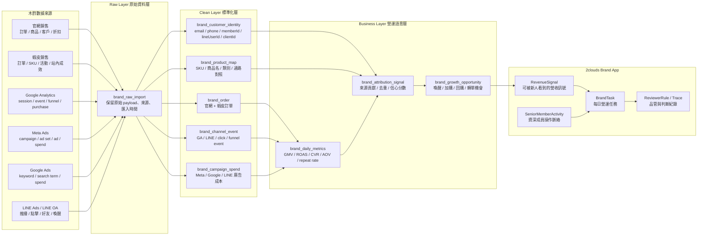

# 木酢寵物達人數據整合架構

本文件定義木酢寵物達人 Brand App 要如何整合官網銷售、蝦皮銷售、Google Analytics、Meta Ads、Google Ads 與 LINE Ads / LINE OA 資料，並把資料回寫成平台可操作的 `RevenueSignal`、`BrandTask`、`SeniorMemberActivity` 與 reviewer 判斷依據。

目標不是把所有報表集中展示，而是建立木酢品牌的單一營運真相層，讓新人、reviewer 與資深成員可以回答：

```text
目前哪些內容、投放、會員經營與客服動作，正在對木酢寵物達人的營收產生貢獻？
```

---

## 1. 整體資料流



---

## 2. 來源角色分工

| 來源 | 在系統中的角色 | 第一版要抓的資料 | 不應誤用 |
|---|---|---|---|
| 官網銷售 | 交易真相來源 | 訂單、商品、客戶、折扣、付款狀態、回購 | 不要只看 GA purchase 當營收真相 |
| 蝦皮銷售 | 第二交易通路 | 訂單、SKU、活動、商品排行 | 不要與官網訂單混成同一筆 |
| Google Analytics | 行為與漏斗來源 | session、source/medium、landing page、add_to_cart、checkout、purchase event | 不要直接當最終營收 |
| Meta Ads | 投放成本與素材來源 | campaign、ad set、ad、spend、impressions、clicks、conversion | 不要把 Meta purchase 當未去重訂單 |
| Google Ads | 搜尋意圖與成本來源 | campaign、ad group、keyword、search term、spend、clicks、conversion | 不要和 Meta 用同一套素材判斷 |
| LINE Ads / LINE OA | 會員喚醒與再行銷來源 | 推播、開啟、點擊、好友、分眾、喚醒活動 | 不要和廣告新客流量混為一談 |

---

## 3. 統一資料鍵

所有資料進入 Clean Layer 後都必須帶這些欄位：

```text
brandId
sourceSystem
sourceRecordId
occurredAt
ingestedAt
channel
campaignId / campaignName
productId / sku
customerKey
orderId
amount
currency
confidence
```

木酢第一版 `brandId` 固定為：

```text
brand-muzopet
```

身份對齊第一版只做 deterministic matching：

```text
email
phone
memberId
lineUserId
orderId
gaClientId
```

不做推測式身份合併。無法確認是同一人的資料，只能在 attribution 裡標成 lower confidence。

---

## 4. 歸因優先順序

木酢第一版不做複雜 multi-touch attribution，先用保守規則：

1. **訂單真相以官網 / 蝦皮訂單為準。**
2. **廣告平台 conversion 只當投放訊號，不直接當營收。**
3. **GA purchase event 可輔助比對，但不能覆蓋訂單資料。**
4. **LINE OA 喚醒若能對到會員 / 手機 / coupon，優先標記為 retention 訊號。**
5. **無法對到訂單的 click / session，只能產生 lead 或 engagement 訊號。**

---

## 5. 回寫到 Brand App 的規則

資料整合後不要只產報表，要回寫成平台可以運作的物件。

### RevenueSignal

用於回答「哪裡有營收機會或風險」：

```text
會員喚醒回購率上升
某商品組合加購率提高
某廣告素材 CTR 高但轉換低
某搜尋字帶來高意圖流量
LINE 推播點擊高但未成交
```

### BrandTask

用於回答「新人今天要做什麼」：

```text
整理會員喚醒文案三版
檢查高 CTR 低轉換素材的 landing page 是否對齊
整理蝦皮高銷售 SKU 與官網商品頁差異
回顧 LINE 推播點擊最高的三個 CTA
```

### SeniorMemberActivity

用於保留資深成員的判斷脈絡：

```text
藝嘉修正寵物健康宣稱紅線
Sophia 確認本週推廣商品
Jacky 判斷是否啟動會員喚醒波次
```

### ReviewerRule

用於檢查輸出是否能進入真實營運：

```text
不得把醫療功效寫成商品承諾
不得向退訂會員或毛孩已過世客戶發送喚醒訊息
不得把廣告平台 conversion 當成未去重營收
所有推播與文案必須連到商品、客群、營收訊號其中之一
```

---

## 6. 實作階段

### Phase 1：手動匯入與營運訊號

- 允許 CSV / 報表手動匯入
- 先建立 `RevenueSignal`
- 先支援官網、蝦皮、GA、Meta、Google Ads、LINE 的摘要資料
- 不做自動發送、不做自動歸因決策

### Phase 2：標準化資料表

- 建立 `brand_order`
- 建立 `brand_channel_event`
- 建立 `brand_campaign_spend`
- 建立 `brand_customer_identity`
- 建立 `brand_product_map`

### Phase 3：API Connector

- 串官網訂單 API 或匯出排程
- 串 GA4 Data API
- 串 Meta Ads API
- 串 Google Ads API
- 串 LINE Ads / LINE OA API
- 蝦皮視可用權限決定 API 或定期匯入

### Phase 4：任務化與品管閉環

- 每日產生木酢 BrandTask
- 每週產生營收歸因摘要
- reviewer 對任務與訊號做 pass / needs_revision
- trace log 回寫到品牌營運歷史

---

## 7. 第一版驗收標準

木酢數據整合第一版完成時，平台應該能回答：

```text
1. 本週官網與蝦皮各自賣了什麼？
2. 哪些廣告花費帶來有效流量？
3. 哪些 LINE / 會員動作可能帶來回購？
4. 哪些商品類別值得做內容或活動？
5. 新人今天應該做哪個任務？
6. reviewer 要用哪些規則判斷這個任務是否可用？
```

第一版不追求精準歸因。第一版的目標是把資料變成可操作訊號，讓木酢 Brand App 真正開始運作。
